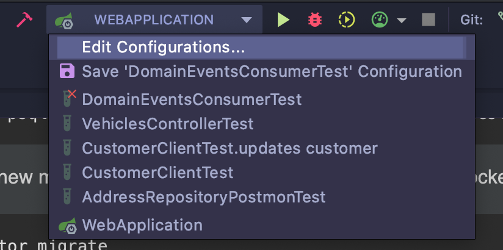

# Reporting API

 
 
 
 
 
 


## TL;DR - What it is?

An API developed by me for portfolio purposes

## Documentation

[Business Specification](https://github.com/DavidVasconcelos/reporting-api/blob/master/docs/reporting-api.pdf)

## First Steps

### Using Docker

> [!WARNING]
> **Prerequisites**
> 
> Install Docker and Docker-Compose on your machine

* [Docker][]
* [Docker Compose][]

[Docker]: https://docs.docker.com/install/ "About Docker CE"
[Docker Compose]: https://docs.docker.com/compose/install/#install-compose "Install Docker Compose"

Some interesting Gradle *targets* (build system):

* `./gradlew dependencies`: Dependencies download
* `./gradlew build`: Full project build (with dependencies download too)
* `./gradlew detekt`: Linter that fixes simple errors and reports syntax problems.


To create the database locally for the first time:

    $ docker-compose up -d reporting_db

For migrations (when new migrations are added, is necessary to execute docker build and have the database created)

    $ docker-compose run reporting_api migrate

Run inside your project root:

    $ docker-compose up -d

### Endpoints

* Local URL: http://localhost:8080/api/v3
* Check application health: http://localhost:8080/api/v3/health
* [API documentation (local with Swagger)](http://localhost:8080/api/v3/swagger-ui/index.html)


### (OPTIONAL) Running with IntelliJ Ultimate

On your IntelliJ top bar, go to `Edit Configurations...`



Change `VM Options` to:

```
-Dspring.profiles.active=local
```

### Running tests and lint

> [!WARNING]
> You will need `Docker` service running in your machine to run tests.

It's possible to run commands configured in Gradle (by plugins included in `build.gradle`) to run tasks like test or lint. The command below execute application build, test, and lint:

This way, before committing, you can check for any possible problems in your change.

`$ ./gradlew clean && ./gradlew build && ./gradlew test && ./gradlew detekt`

To lint (Detekt) inside IntelliJ IDEA, use this plugin: [detekt to IDEA](https://plugins.jetbrains.com/plugin/10761-detekt).

> [!IMPORTANT]  
> A `git hook` running `./gradle check` will perform before every `git push` 

## Architecture

### Used libraries:

* **Gradle**: Build tool and dependency manager. ("Rake" + "Bundler")
* **Spring**: Web framework ("Rails")
* **Spring Data/JPA**: Postgres persistency framework ("Sequel")
* **Spring Security**: To implement the JWT standard
* **Spring Cache**: To implement caching
* **Flyway**: Postgres migration manager (made with pure SQL)
* **Kluent**: Fluent assertions
* **[Validktor](https://github.com/valiktor/valiktor)**: Is a type-safe, powerful and extensible fluent DSL to validate objects in Kotlin.
* **[SpringMockK](https://github.com/Ninja-Squad/springmockk)**: Support for Spring Boot integration tests written in Kotlin using MockK instead of Mockito.
* **Testcontainers**: Testcontainers is a Java library that supports JUnit tests, providing lightweight, throwaway instances of common databases, Selenium web browsers, or anything else that can run in a Docker container.
* **Jackson**: JSON serializer/deserializer
* **OpenAPI**: Automatic API documentation generation tool with UI accessible from `http://localhost:8080/api/v3/swagger-ui/index.html`
* **Actuator**: A tool with monitoring features (used to delivery `/health` route)
